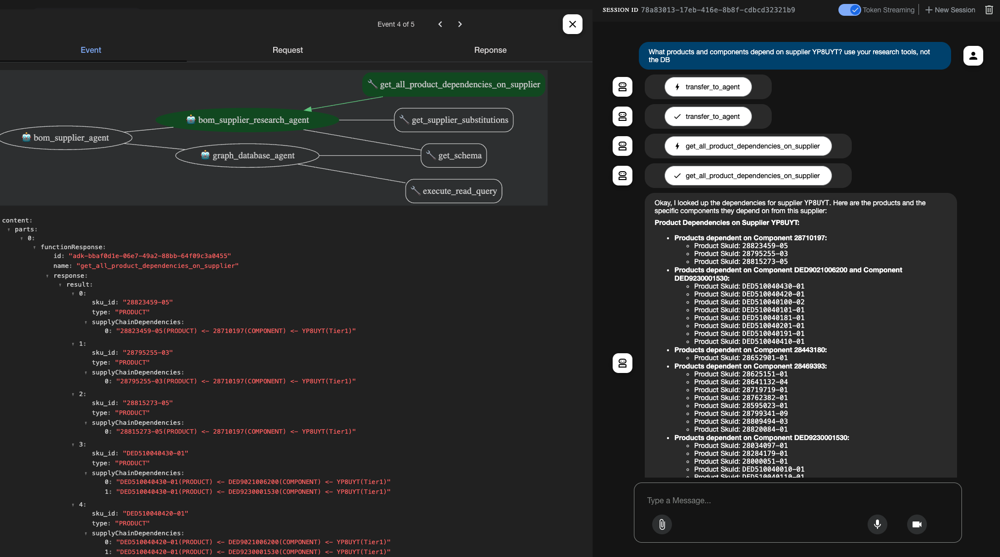

# ADK Agents

## Tools, Queries and Agent Basics
The notebook [get-started-with-adk-graphrag.ipynb](get-started-with-adk-graphrag.ipynb) walks through the basics to get started. including:
1. Calling LLM models
2. Creating general GraphRAG tools
3. Creating specialized GraphRAG retrieval tools for specifc BOM and Supplier query patterns
4. Creating a multi-agent system with tools, conversational memory, reasoning, agent routing, etc. 

To visualize what these queries are doing, you can load the [neo4j_query_saved_cypher.csv](neo4j_query_saved_cypher.csv) into the Aura console.  Run the `set params` query first which will then allow you to run the others.  These queries replicate the logic in key tools and output a graph result to visualize.


## Agent Web UI and Deployment
The directory [./app](./app) contains an agent to deploy onto cloud run per directions in the [adk-docs](https://google.github.io/adk-docs/deploy/cloud-run/).
specifically you will do the following:

> before starting ensure you have authenticated with Google Cloud (gcloud auth login and gcloud config set project <your-project-id>).

First create a `.env` file in the `app/bom_supplier_agent` directory with your credentials. Use the `.env.template` for reference.

Next go to the terminal and make sure you are in the `app/` directory. 

set env variables
```bash
# Set your Google Cloud Project ID
export GOOGLE_CLOUD_PROJECT="your-gcp-project-id"

# Set your desired Google Cloud Location
export GOOGLE_CLOUD_LOCATION="us-central1" # Example location

# Set the path to your agent code directory
export AGENT_PATH="./bom_supplier_agent" 

# Set a name for your Cloud Run service (optional)
export SERVICE_NAME="bom-supplier-agent-service"

# Set an application name (optional)
export APP_NAME="bom-supplier-agent-app"
```
Then simple use the adk cli:
```bash
adk deploy cloud_run \
--project=$GOOGLE_CLOUD_PROJECT \
--region=$GOOGLE_CLOUD_LOCATION \
--service_name=$SERVICE_NAME \
--app_name=$APP_NAME \
--with_ui \
$AGENT_PATH
```

You may get a prompt `Allow unauthenticated invocations to [bom-supplier-agent-service] (y/N)?`. enter `y` for this.  If you do not get the prompt you will need to update later through thre CLoud Run console.  This is necessary to test the UI. 
the adk should have been installed with the requirements.txt file. 

You will get a link that you can click on which will bring you to a ui interface.  You can ask questions and see the resulting logic:


The left side panel provides deeper visibility into Agent steps, tools, and routing


You can also see the API itself by replacing `/dev-ui/..` at the end of the url with `/docs`


## Running with `mcp-neo4j-cypher`
The above deployment does not leverage Model Context Protocol (MCP) for natural language query generation tools in the `database_agent`. It instead uses locally defined python functions for such capabilities.  The `app/bom_supplier_agent_mcp` directory does include MCP, but we recommend using Claude 4 for the database agent as it seems to work better at the moment.  To deploy you similarly provide a `.env` file and simply change the env variables:

```bash
# Set your Google Cloud Project ID
export GOOGLE_CLOUD_PROJECT="neo4jeventdemos"

# Set your desired Google Cloud Location
export GOOGLE_CLOUD_LOCATION="us-central1" # Example location

# Set the path to your agent code directory
export AGENT_PATH="./bom_supplier_agent_mcp" 

# Set a name for your Cloud Run service (optional)
export SERVICE_NAME="bom-supplier-agent-mcp-service"

# Set an application name (optional)
export APP_NAME="bom-supplier-agent-mcp-app"
```
Then simple use the adk cli:
```bash
adk deploy cloud_run \
--project=$GOOGLE_CLOUD_PROJECT \
--region=$GOOGLE_CLOUD_LOCATION \
--service_name=$SERVICE_NAME \
--app_name=$APP_NAME \
--with_ui \
$AGENT_PATH
```


